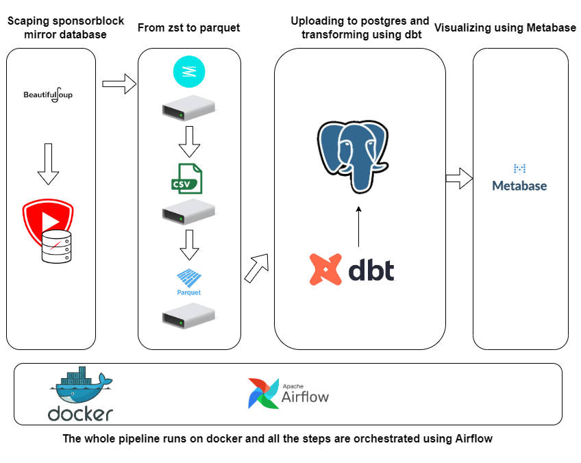
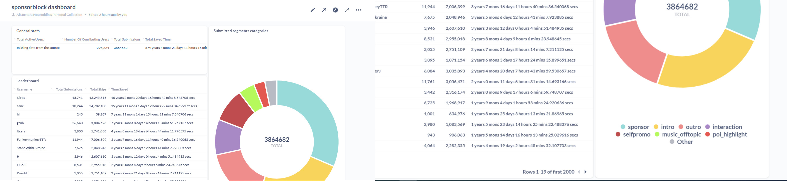

# Sponsorblock-data-pipeline-de-zoomcamp-final-project
Final Project for DataTalksClub's Data Engineering Zoomcamp
# Problem statement:
The goal is to recreate [sponsorblock's dashboard](https://sponsor.ajay.app/stats) which contains: general statistics about sponsorblock and the leaderboard, also creating a visual for the categries of the segments submitted.
## What is sponsorblock?
[SponsorBlock](https://sponsor.ajay.app/) is an open-source crowdsourced browser extension and open API for skipping sponsor segments in YouTube videos.
Sponsorblock opens their data for free wheither it's through their [api](https://wiki.sponsor.ajay.app/w/API_Docs) or their [database](https://sponsor.ajay.app/database), but I opted to download the data from a [mirror database]() to avoid any unnessecary traffic on the main api.
for mirror databases you have the following options:
- [Firt link](sb-archive.mchang.xyz) : 24hr delay + rsync + http(s)
- [Second link](sb-mirror.mchang.xyz) : 5 minute delay + rsync + http(s)
- [Third link](https://sb.ltn.fi/database) : 5 minute delay + http(s)
- Or follow the instructions [here](https://github.com/mchangrh/sb-mirror) to create your own mirror.

## Tools used:
- **Docker**: The whole project is dockerized which helps in eliminating some of the dependancies issues 
- **Airflow**: all the steps are orchestrated using airflow 
- **dbt**: dbt is used in creating the final tables
- **Postgresql**: for data wharehousing I chose postgres running on a seperate docker container
- **Metabase**:Metabase is used in creating the final dashboard
- **BeautifulSoup**: is used in scraping the data files

# Database Schema:
The schema in details can be viewed from here [here](sponsorblock_db_schema.md)
# Project structure:


# Steps:
- scraped the data from [this](sb-archive.mchang.xyz) url using *BeautifulSoup*
- the downloaded data is compressed using [zstandard](https://github.com/facebook/zstd) compression algorithm, so it first need to be decompressed
- after decompressing and extracting the csv files,the csv files be converted to parquet
- the data will then be ingested to postgres
- dbt models will create the final tables needed for the visualization
- Lastely Metabase is used to create the dashboard 
# Final daashboard


# How to recreate?
- clone this repo 
  ```
  git clone https://github.com/almustafa-noureddin/  sponsorblock-data-pipeline-de-zoomcamp-final-project.git
  cd sponsorblock-data-pipeline-de-zoomcamp-final-project
  ```
- add credentials to .template.env files and profiles.yml in ./airflow/.dbt
- build airflow docker container
  ```
  cd airflow
  docker-compose build
  docker-compose up
  ```
- build postgres container
  ```
  cd ..
  cd postgres-docker
  docker-compose up
  ```
- type `localhost:8080` in your beowser and activate the dag
- build metabase container
  ```
  cd ..
  cd metabase-docker
  docker-compose up
  ```
- type `localhost:3000` in your beowser and connect to your database then create your dashboard